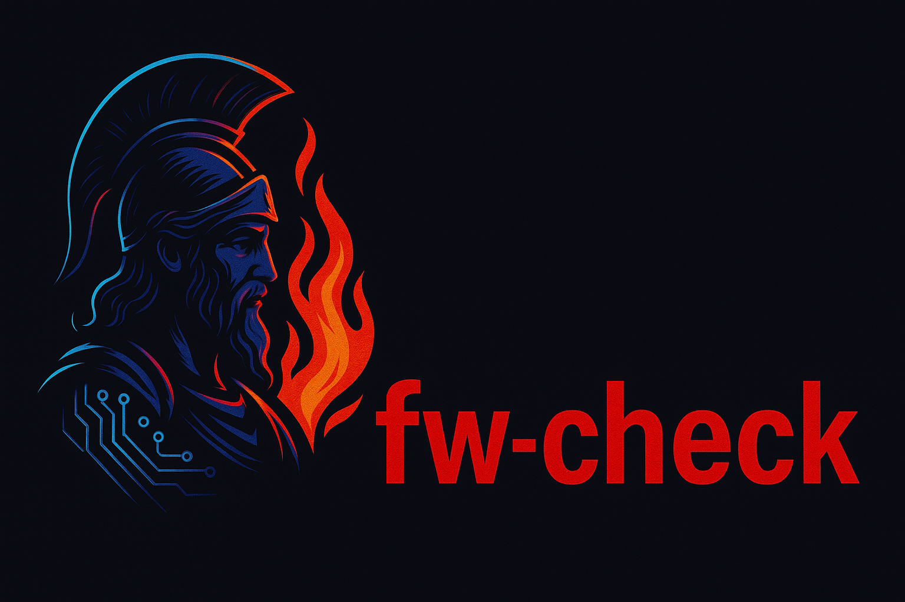

<div align="center">
  
</div>

# fw-check 🔥🛡️

## Description
**fw-check** is a smart firewall testing tool that validates `iptables`/`nftables` rules by simulating real traffic. It goes beyond basic port scanning to verify actual protocol behavior (TCP/UDP/ICMP) with actionable results.


## Features

### 1. **Protocol-Aware Testing**  
   - **TCP**: Validates full connection handshakes (not just SYN scans)  
   - **UDP**: Detects explicit blocks vs. silent drops  
   - **ICMP**: Tests ping policies separately  

### 2. **Bidirectional Validation**  
   - Checks if firewall rules allow expected **inbound + outbound** traffic flows  

### 3. **Expectation Matching** (`--expect`)  
   - Compares results against predicted behavior (allow/deny) for CI/CD integration  

### 4. **Human & Machine Readable Output**  
   - ✅/❌ visual indicators  
   - Explicit reasons for blocks (e.g., `Connection refused` vs `Timeout`)  


## Installation  
```bash
git clone https://github.com/yourrepo/fw-check.git
chmod +x fw-check.sh
```

## Usage
```bash
./fw-check.sh --host <IP> --proto <tcp|udp|icmp|any> --port <PORT> [--expect <allow|deny>]
```

## Examples
./fw-check.sh --host 192.168.1.1 --proto tcp --port 80	
./fw-check.sh --host 10.0.0.5 --proto udp --port 53 --expect allow	
./fw-check.sh --host 203.0.113.45 --proto any

## Sample Output
```text
Testing firewall rules for 192.168.1.100...
✅ TCP/22 → ALLOWED (Host: 192.168.1.100)
❌ UDP/53 → DENIED (Host: 192.168.1.100) (Timeout/no response)
✅ ICMP → ALLOWED (Host: 192.168.1.100)
✔️ All results match expected: allow
```
